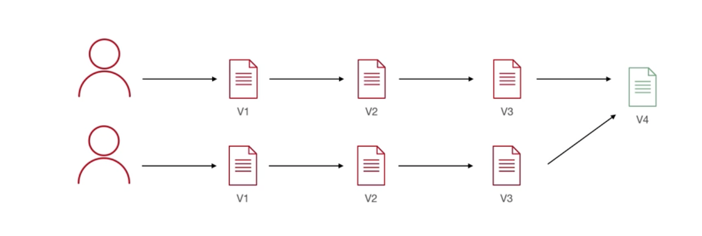

## 
    مفهوم أنظمة التحكم بالنسخ VCS  </dir > 

### 
 git ينتمي إلى   Version control systems التي تسمح لك بإدارة الملفات و تتبعها. تحفظ الملفات في repository التي تحتوي على تاريخ يظهر جميع التعديلات و التغييرات التي حدثت على المشروع.</dir > 

### الطريقة التقليدية كانت عبارة عن كل شخص بالفريق  يقوم بتحميل الملفات ويجري التعديلات   ثم مشاركتها عن طريق البريد الالكتروني ليتم تدقيقها وتجميعها في ملف واحد  

