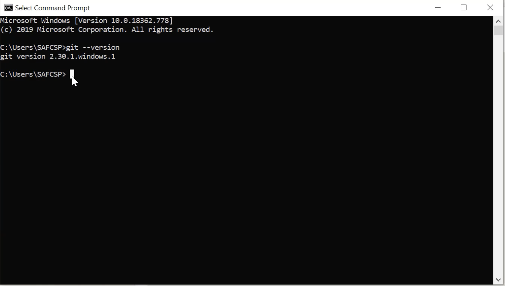

## 
  تنزيل git على نظام windows   </dir > 

 
 ١- قم بزيارة موقع git  </dir>

  [git](https://git-scm.com/downloads)

  
   ٢- قم بالضغط على windows  </dir>  

  
٣- قم بتحميل الملف 

٤- قم بتنصيب الملف 

  
   ٦  - للتأكد من نجاح    التحميل و تثبيت البرنامج، قم بالبحث عن CMD  واكتب الامر الاتي 
   </dir>  

` git --version`

٦- عند ظهور الاصدار فقد قمت بتثبيت البرنامج بنجاح 

  
  