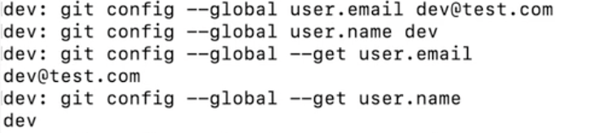

# 
  تهيئة  git  </dir > 

### 
   للإنتقال من مرحلة stage إلى مرحلة committed يجب علينا أن نهيئ git  بإدخال البريد الاكتزوني و اسم المستخدم   </dir > 

 
   ١- افتح terminal و اكتب الامر التالي  </dir > 

` git config --global user.email YOUR EMAIL`

لقد قمت بإدخال البريد الالكتروني والان قم بادخال اسم المستخدم 

`git config --global user.name "first and last name"`

ولاستعراض اسم المستخدم والبريد الالكتروني المستخدم ، نستخدم الامر 

 `git config --global --get user.email`
 `git config --global --get user.name`

