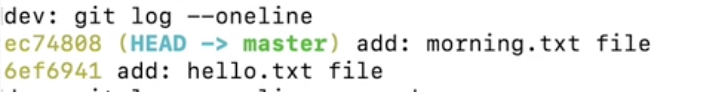
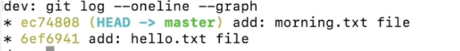

## 
   استعراض تاريخ المشروع باستخدام git log </dir > 

   لاستعراض commit بطريقة مختصرة نستخدم    </dir > 

`git log --oneline` 

   لاستعراض commit بطريقة رسومية نستخدم   </dir > 

`git log --oneline --graph` 

   ملاحظة: يتضح الرسم بشكل اكبر عند وجود فروع  </dir > 
