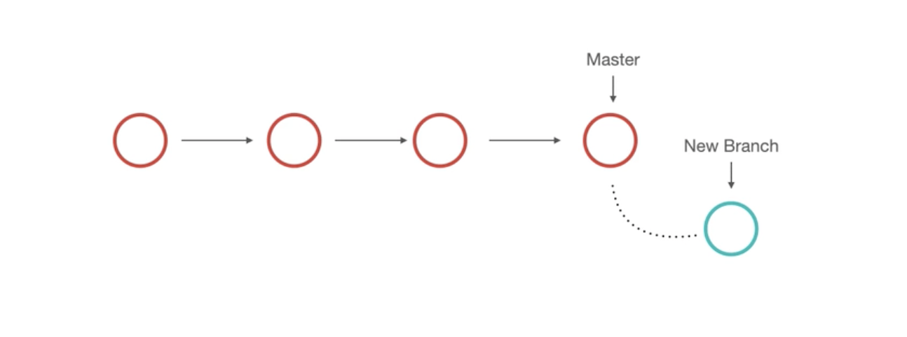
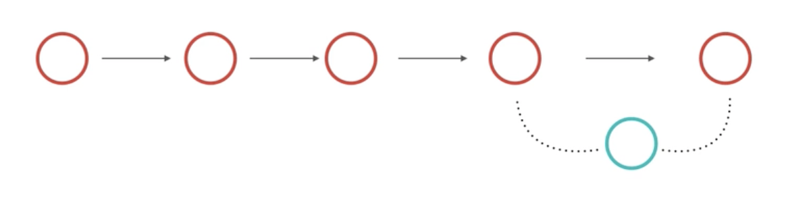
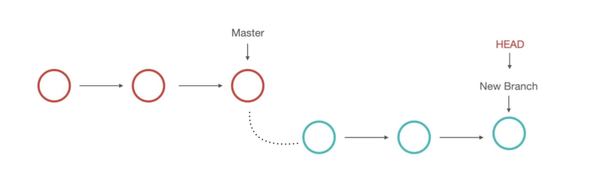

## 
  الفروع branches  </dir > 
##### 
   في بداية تطويرنا للمشاريع نستخدم ممر واحد و هو الرئيسي ثم نتفرع ( خاصة في المشاريع البرمجية) و تأتي أهميتها في اختبار و تطوير خصائص جديدة للمشروع بدون  مخاطرة المسار الفعلي للمشروع  </dir > 

##### 
   فكرة الفروع او branches هي عمل نسخة من المسار الفعلي للمشروع لاختبار الفرضيات و القيام بأي تعديلات قبل دمجها للمسار الفعلي للمشروع ه </dir > 

##### 
   و لاجراء التغييرات بالفروع نقوم بتغيير المؤشر head إلى الفرع . المتواجدين فيه </dir > 

 ###### 
  head عبارة عن مؤشر يشير إلى النقطة الجاري تعديلها</dir> 

