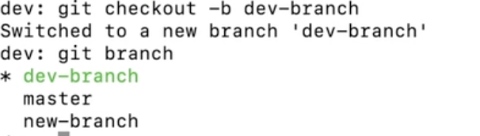

## 
 إنشاء فرع جديد والانتقال إليه   </dir > 

##### 
  لإنشاء فرع جديد والانتقال إليه مباشرة نستخدم الامر   </dir > 

`git checkout -b branchName` 

##### 
  و عند استعراض الفروع ملاحظ أنه تم إنشاء فرع جديد و المؤشر head يشير إليه، بمعنى أننا انتقلنا للفرع الجديد و أي تغيير سيتم حفظه في هذا الفرع  </dir > 
