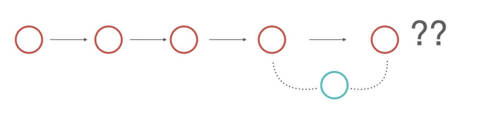

## 
  مفهوم الدمج  </dir > 

#### 
  عند إنشاء فرع جديد تحصل على النسخة الفعلية من المسار الرئيسي للمشروع لتقوم بتعديلاتك ،اختبار فرضياتك. بعد التأكد من الفرضيات و تحسين المشروع الموجود بالفرع تقوم بدمجه مع المسار الفعلي الرئيسي للمشروع.  </dir > 

##### 
  هناك نوعان من الدمج:   </dir > 
###### 
   ١- الدمج المباشر fast-forward merge . و هو أن تعديلك سيتم إضافته للمشروع بشكل مباشر على المسار الرئيسي للمشروع. </dir > 

###### 
   ٢- الدمج الحقيقي true merge و هو أن تعديلاتك لن تدمج مباشرة مع المسار الرئيسي للمشروع </dir > 

