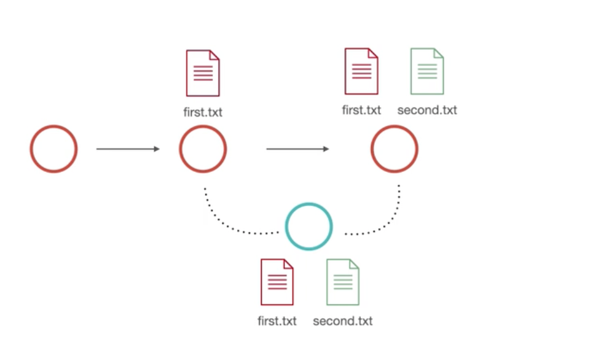

## 
  الدمج المباشر fast-forward merge  </dir > 

#### 
 في هذه الحالة الدمج يكون بشكل مباشر لوجود نسخة جديدة من المسار الفعلي للمشروع والتعديل عليه كان بإضافة ملف جديد    </dir > 

#### 
  لاستخدام الدمج نكتب الامر الاتي   </dir > 

`git merge fileName` 

###### 
  ملاحظة: قبل استخدام الدمج يجب أن نتأكد بزننا في المسار الرئيسي للمشروع master ثم نقوم بالدمج  </dir > 

