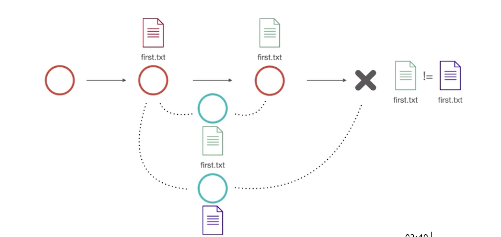

## 
  الدمج الحقيقي true merge  </dir > 

#### 
  إذا قمت بإنشاء فرع جديد و شخص آخر قام بإنشاء فرع جديد، وقمت بتعديل الملف ثم دمجه مباشرة ، ستتعارض النسخة الموجودة بالمسار الرئيسي مع النسخة التي رفعها الشخص الاخر  </dir > 

#### 
    لحل التعارض يجب أن نختار أحد الملفين ليتم متابعته.  </dir > 
