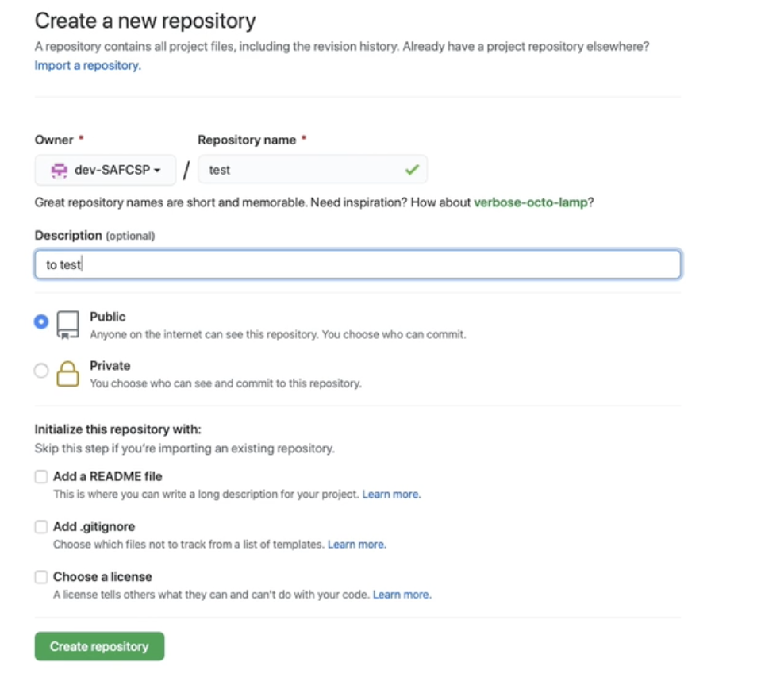
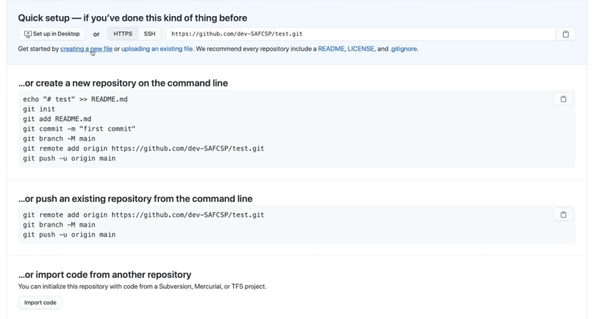
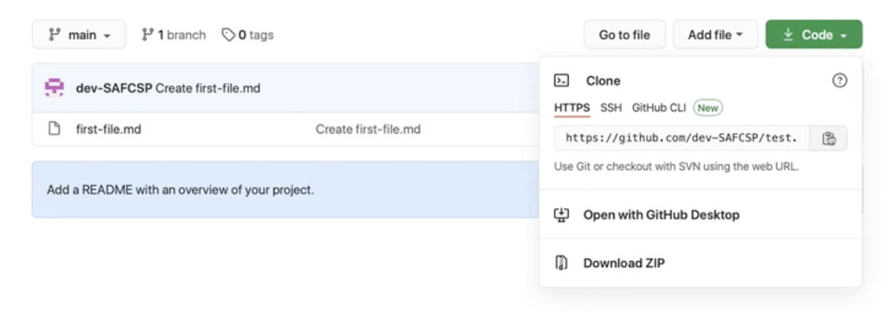
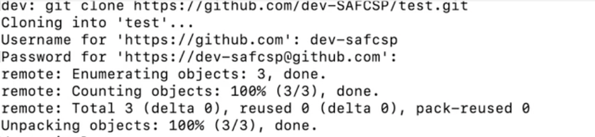

## 
   الامر git clone  </dir > 
#### 
 ١- لإنشاء repository جديدة ندخل على موقع github و نسجل دخول    </dir > 

[github](https://github.com/)

#### 
  ٢- نضغط على create repository  و ندخل المعلومات المطلوبة   </dir > 

#### 
  ٣- لانشاء ملف جديد داخل ال repository نضغط على create file  </dir > 

#### 
   ٤- لاستخدام git clone ، نذهب إلى ال repository و نقوم بالضغط على clone و نسخ الرابط الموجود </dir > 

 
 ##### 
   ملاحظة: git clone تعني عملية نسخ ، بمعنى أنه سيتم نسخ ال repository سواء كانت على github أو gitlab أو غيرها و يتم وضعها محليا على الجهاز </dir > 

 #### 
   ٥- الان نذهب إلى ال terminal و نقوم بكتابة  </dir > 
 `git clone repo-link ` 

 #### 
  و نلصق الرابط المنسوخ في الخطوة السابقة   </dir > 
 
